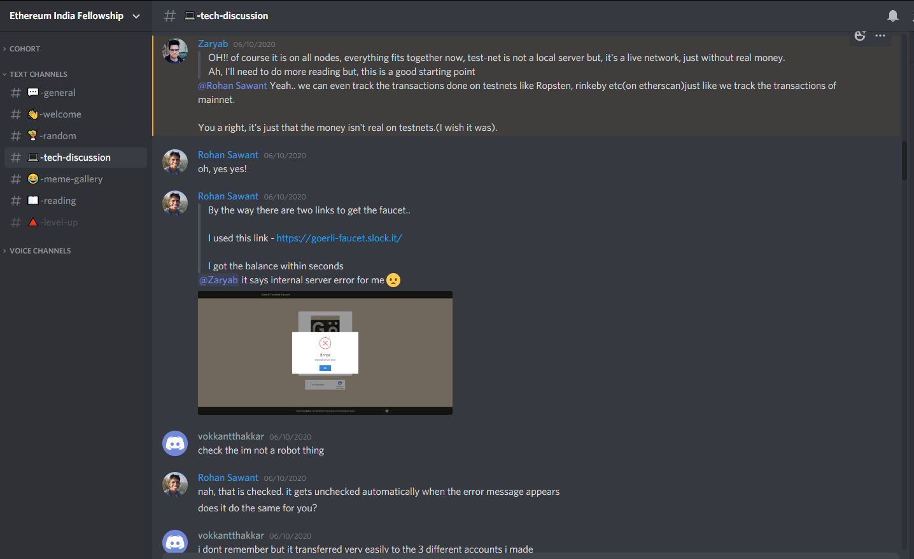

# I got selected for the Devfolio Ethereum India Fellowship, here's how it went! - Week 1 

On the 7th of June, I was selected for the Ethereum India Fellowship, a 4 week mentor-led program to help Web2 developers make the transition to Web3! The program was a collaboration between the Ethereum India Foundation and Devfolio, here's how it went!

## What?

The aim of the fellowship was to demystify blockchain and all of the hype surrounding it, and get down into the nuts and bolts of the technology. The fellowship tried to provide an alternative, easier and faster way for web developers to get started with the blockchain ecosystem. As a part of the fellowship the participants were divided into smaller study groups of 3 with a single mentor assigned to the each of the groups. Weekly video calls were held while allowed us to ask questions and understand things!

## The Application Process

This is a general overview of the application and selection process.

#### 1. Submit the Application through a Google Form - (~10 mins)

Pretty self-explanatory, the application asked us about our past projects, our experience in software development and why we would like to learn more about Blockchain. 

#### 2. Give a Remote Interview - (~15 mins)

I was interviewed by my soon-to-be mentor [Vaibhav](https://twitter.com/vaibhavchellani), & [Denver](https://twitter.com/denverjude), who represented [DevFolio](https://devfolio.co/).  The interview was pretty informal affair, we talked tech, I walked them through [FRAS - An (almost) Decentralized Facial Recognition System with Raspberry Pi Zeros](https://www.linkedin.com/pulse/how-use-facial-recognition-rpi-zeros-turn-your-school-rohan-sawant/) one of my older side projects, Vaibhav even talked about [HashCash - A crypto-economic protocol to build better public communication tools](https://hackmd.io/@n2eVNsYdRe6KIM4PhI_2AQ/rkiV79oDI). To sum it up, it was a pretty engaging ordeal!

#### 3. Respond to a mail confirming my acceptance! - (~0.1 secs)

I sent an overenthusiastic email in response, and I was in.

## Meeting the Mentors!

The following Monday night over a Zoom meeting we were introduced to our mentors. The participants were divided into smaller study groups of 3 or 4 with a mentor assigned to the group, which meant we were able to get very personalized attention and a safe space to ask questions, no matter how stupid or silly they sounded. [Vaibhav Chellani](https://twitter.com/vaibhavchellani) was appointed as our mentor! A list of tasks to be completed in the week was shared, we were added to a Discord server, where the mentors were there to help us practically 24x7 and the meeting concluded.

## Week 1

We went over the basis of Ethereum, API connectivity and transactions, in this week. 

##### 1. Setup a Geth Node

Task 1 was to setup our own Geth Node - a computer which participates in the Ethereum Network.

I tried to use Docker to setup Geth, but that did not work, my node just kept searching for peers. Then I tried to run Geth natively, and after a few tries that worked. But, downloading the entire Goreli Testnet was taking way longer than expected, I left that run overnight. 

I then moved on to setup an AWS EC2 instance to run the Geth Node and finish syncing, that worked! I was able to finally move on to the next task.

> After I assigned a public IP to my Geth Node and opened all the ports, I noticed my node kept crashing, on further inspection of the logs it looked like someone was trying to get my EC2 Instance to mine Ether, I shared this with Vaibhav, and indeed my suspicion that bots were trying to get my Node to mine ether was correct. Opening all of the ports and keeping the `personal` APIs open was not the correct decision, I fixed that!

#### 2. Sending Transactions to the Blockchain

The next task was to use interface with the newly synced Geth Node, using one of the several libraries available for this, I chose to do it using [web3js](https://web3js.readthedocs.io/en/v1.2.8/index.html) with Node.

I created a new Ethereum Account, gave myself from Ethereum on the Testnet, used the management API to sign the message, and sent a transaction to another public address. Basically we figured out how to write data to the blockchain and moved on to the next task. 

#### 3. Reading data from the blockchain

Here, the goal was to retrieve first 128 block hashes of the Goreli Testnet chain and print them out in a text file, this was pretty easy.

Next, we were supposed to find the first block on the blockchain to which a smart contract is deployed to. This was deceivingly complicated, all of the participants used different approaches to distinguish the transaction blocks from smart contract blocks. I being a simpleton just compared the sizes of the blocks, "SmartContracts are bigger than simple Transactions, their size will be larger", I deduced that if a block was ~12x that of most other blocks it has to be different than them, it has to be a smart contract. This suspicion indeed turned out to be correct as all of the other participants got the same answer as well.

## Closing

Closing? It was super fun and something which I had never tried before. Blockchain to me always sounded exactly like what it probably sounds to you right now, it was like a dark giant ball of a messy paraphernalia, now it just more like a tangled ball of strings, they made it look less-confusing and more approachable. This is was my first time venturing into something so unknown, having mentors and a direct line to all of their collective knowledge(s?) essentially halved the time we would have needed to grasp the concepts ourselves. 5/5 for me! 

I am pretty excited for week 2, I'll keep y'all  posted.

## Check out the code on Github

- [CT83/Ethereum-India-Fellowship](https://github.com/CT83/Ethereum-India-Fellowship)

